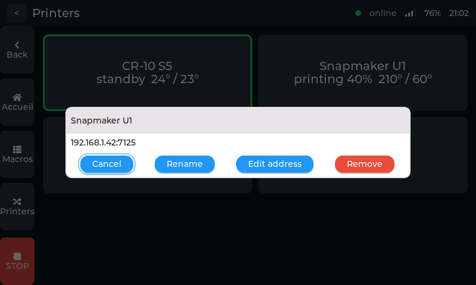

*This page is also available in [French](README.md).*

# BTT K-Touch Custom

Open firmware and reverse-engineering tooling for the **BIGTREETECH K-Touch**, a
5-inch ESP32-S3 touch screen whose development was discontinued by its
manufacturer (last published release: `v1.1.0`, November 2024, which identifies
itself as a beta).

The project pursues two goals on a shared technical foundation: giving owners of
the device a living, buildable firmware again, and repurposing it to drive an
astrophotography tracker.

## Status — full Klipper client, validated on real printers

The device runs a custom firmware from an OTA slot, without ever touching the
factory firmware, and reverts to stock on command. On top of that foundation,
the interface is today a **full Moonraker client**, used for real printing on
two machines: a Creality CR-10 S5 and a multi-head Snapmaker U1.

What the screen can do:

- **Home**: temperatures of every heater, history graph with a numbered vertical
  scale, position, active tool, print progress and a thumbnail of the current
  gcode.
- **Printing**: Moonraker file list, macros, actions (pause, resume, cancel,
  emergency stop), gcode console, fine tuning while printing.
- **Machine settings**: movement and homing, temperatures with checkable targets
  and PLA/PETG/ABS/TPU presets, extruder, fans, Z calibration, bed levelling,
  limits, retraction, **bed mesh** (heatmap, calibration, saved profiles) and
  **input shaper**.
- **Peripherals**: USB stick (folder-by-folder browsing, upload to Moonraker),
  power devices, **Spoolman** (spools and loaded spool).
- **Operations**: a fleet of several printers with sequential switching, WiFi
  settings on the screen, and **firmware updates over WiFi** with an A/B slot and
  rollback.

All of it stays verifiable without hardware: **[`simulateur/`](simulateur/)**
(LVGL + SDL on a PC, with PNG screenshots to back it up) and
[`host-test/`](host-test/) (a C suite; see its README for the up-to-date count).

The result that has value beyond this repository is still
**[`docs/hardware/pinout.en.md`](docs/hardware/pinout.en.md)**: the first public
verification of the 5-inch K-Touch pinout, display and touch alike. The only
pinout available until now was the one for the 7-inch Panda Touch, and the
`nomadsgalaxy/Prusa-Connect-Touch` project noted that the K-Touch "may differ on
a few panel GPIOs or timings". That caveat is now lifted: it works as is, with
no adaptation.

Verified on hardware:

- 800×480 RGB panel in DE mode — colours, geometry and stability as expected,
  and 49 minutes of continuous operation with no reboot and no memory leak on
  the very first attempt, on 26 July 2026;
- the **tear-free timings for an animated interface** (14.8 MHz, wide porches)
  are documented separately from those that were enough for a static test
  pattern: the difference only shows in motion, and that is precisely what the
  other ports had no way of measuring;
- GT911 touch controller at I²C address `0x5D`, mapping directly onto the
  display, with no rotation and no mirroring;
- octal PSRAM running at 80 MHz.

## Interface tour

The 33 images below cover **every screen in the firmware**. These are not
mock-ups: they are 800×480 RGB565 captures produced by
[`simulateur/`](simulateur/), which compiles the real screen code — the same
pixels the panel receives. A single command regenerates them,
[`tools/captures-readme.sh`](tools/captures-readme.sh), which keeps them from
going stale after an interface change.

### Home and printing

| | | |
|:-:|:-:|:-:|
|  **Home** — heaters, temperature history, position |  **Tool changer** — four extruders, one curve per heater |  **Printing** — progress, time left, emergency stop |
|  **Files** — the gcode list served by Moonraker | | |

### Actions and motion

| | | |
|:-:|:-:|:-:|
|  **Actions** — the machine command submenu |  **Move** — X/Y/Z jog, adjustable step and speed |  **Homing** — per axis or all at once |
|  **Macros** — the Klipper macros, paginated |  **Temperature** — checkable targets and material presets |  **Extrude** — manual extrusion and retraction |
|  **Fan** — slider and quick steps |  **Fine tune** — Z offset, speed and flow while printing |  **Console** — gcode sent, Klipper replies |

### Calibration and settings

| | | |
|:-:|:-:|:-:|
|  **Configuration** — the settings index |  **Z calibrate** — probe or endstop, hundredth-mm steps |  **Bed level** — screws, Z-tilt, QGL |
|  **Bed mesh** — heatmap, numeric bounds, profiles |  **Input shaper** — type and frequency per axis |  **Limits** — machine speed and accelerations |
|  **Retraction** — firmware retraction |  **Spoolman** — spools, material, remaining, active spool | |

### System

| | | |
|:-:|:-:|:-:|
|  **WiFi** — scan and connect from the screen |  **Power** — the outlets driven by Moonraker |  **USB key** — folder-by-folder browsing |
|  **Printers** — several machines, probed state, switching |  **Updater** — active OTA slot and version |  **First boot** — unconfigured device |

### Keyboards and dialogs

| | | |
|:-:|:-:|:-:|
|  **Text keyboard** — host address entry |  **Numeric keypad** — temperature target |  **Destructive confirmation** — cancelling a print |
|  **Homing confirmation** — axis already homed |  **Host entry** — at first boot |  **Printer actions** — long press: rename, edit the address or remove |

## How this firmware can be reversible without a cable

The development device is reachable **over WiFi only**: `esptool` is out of the
picture, and no backup of the 16 MB is possible. The firmware therefore carries
its own way back, through three mechanisms ranging from the most automatic to
the most manual.

An **automatic rescue**, armed before anything else, switches back to the
factory firmware if the network does not answer within the allotted time; it
depends on neither the display, nor the touch controller, nor the network. A
**boot counter** in RTC memory closes off the class of failures too fast for
that timer. And a request to **`/revert`** switches back on demand — with
nothing to upload, since the factory firmware is never overwritten.

The first two were proven under real conditions before the third was ever
needed: during the trials where WiFi failed to associate, the device returned to
stock on its own, twice.

## Repository contents

| Path | Role |
|---|---|
| [`firmware/`](firmware/) | The ESP-IDF firmware and its build instructions — see [`firmware/README.en.md`](firmware/README.en.md) |
| [`host-test/`](host-test/) | Unit tests (C, on a PC) of the "non-visual" code AND of the screens, with no hardware and no ESP-IDF — see [`host-test/README.en.md`](host-test/README.en.md) |
| [`simulateur/`](simulateur/) | LVGL interface running the screen on a PC (SDL window or offscreen PNG screenshot), with no K-Touch hardware — see [`simulateur/README.en.md`](simulateur/README.en.md) |
| [`exemples/backend_jouet/`](exemples/backend_jouet/) | Minimal toy backend and toy screen: the proof, and the template, that a third-party application hooks into the same core as Klipper without modifying it — see [`exemples/backend_jouet/README.en.md`](exemples/backend_jouet/README.en.md) |
| [`shim/`](shim/) | Substitute headers for building `firmware/main/core/` on the PC side (`host-test/`, `simulateur/`) without ESP-IDF |
| [`tools/ktouch/`](tools/ktouch/) | Python library (standard library only): ESP32 images, partition table, `otadata` |
| [`tools/moonraker-record/`](tools/moonraker-record/) | Recorder for real Moonraker sessions, feeding the replay fixtures used by the tests — see [`tools/moonraker-record/README.en.md`](tools/moonraker-record/README.en.md) |
| `ktouch-cli.py` | Launcher: `verify`, `otadata`, `make-otadata`, `image` |
| [`docs/captures/`](docs/captures/) | The screenshots in this README, regenerated by [`tools/captures-readme.sh`](tools/captures-readme.sh) |
| [`docs/hardware/`](docs/hardware/) | Verified pinout, partitioning, installation and revert procedures |
| [`docs/dev/`](docs/dev/) | Development notes, including how to set up a simulated Klipper for the tests |
| [`CHANGELOG.en.md`](CHANGELOG.en.md) | Release notes: what the firmware does, what has been verified, and its known limitations |

Building requires ESP-IDF v5.5.5 and your WiFi network details; everything is in
[`firmware/README.en.md`](firmware/README.en.md). For the Python tooling, run
`python -m pip install -r tools/requirements.txt` then `python -m pytest`.
For the C test suite (no hardware and no ESP-IDF needed, a few seconds under
WSL), see [`host-test/README.en.md`](host-test/README.en.md).

## Disclaimer

Reprogramming the device is at your own risk. The approach is designed to be
reversible — the factory firmware stays intact in its slot — but **without
serial access, no full backup is possible**: were all of the mechanisms above to
fail, the serial route would be the only way left to regain control. Read
[`docs/hardware/flashing.en.md`](docs/hardware/flashing.en.md) before you start.

## Licence

MIT for the code in this repository.

Hardware support comes from the
[`bigtreetech/PandaTouch_IDF`](https://github.com/bigtreetech/PandaTouch_IDF)
component, **whose licence is an open problem**. That repository shows a
"License: MIT" badge pointing to a `LICENSE` file that does not exist, its
README itself says "provided under the MIT License (*assumed*)", and GitHub's
licence API detects no licence there. Code published without a licence remains
under full copyright.

The component was initially referenced as a submodule, precisely so that none of
it would be redistributed. Since 31 July 2026 it is **present in this tree**
(`firmware/components/PandaTouch_IDF/`, 1,826 lines, with two local patches):
this repository therefore redistributes unlicensed code. A report has been
opened with BIGTREETECH
([`PandaTouch_IDF#1`](https://github.com/bigtreetech/PandaTouch_IDF/issues/1));
the question remains open and must be settled before any publication — see
[`docs/licence-du-composant-btt.en.md`](docs/licence-du-composant-btt.en.md),
which details the findings, the options and the report drafted for BIGTREETECH.

Three other third-party dependencies, vendored so that everything builds without
hardware:

- **LVGL** — MIT. Git submodule (`simulateur/lvgl`, pinned to `v9.2.2`, see
  `.gitmodules`) for `simulateur/` and `host-test/`, and an ESP-IDF registry
  component (`firmware/managed_components/lvgl__lvgl`) for the target — the same
  library, fetched through two mechanisms depending on the build context.
- `simulateur/vendor/stb_image_write.h` — MIT or public domain (dual licence, at
  your option), Sean Barrett. Used only to write the PNG screenshots of the
  offscreen mode.
- `host-test/vendor/cJSON.c` — MIT. JSON parser used by the host test suite.
